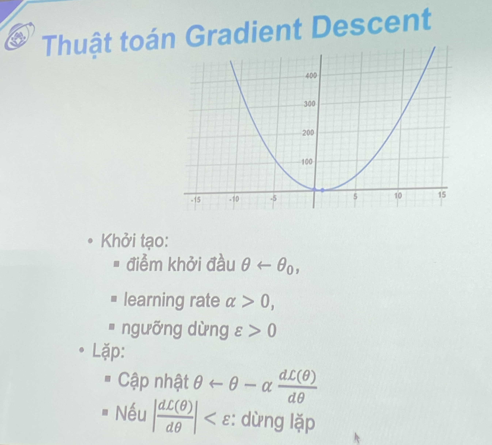
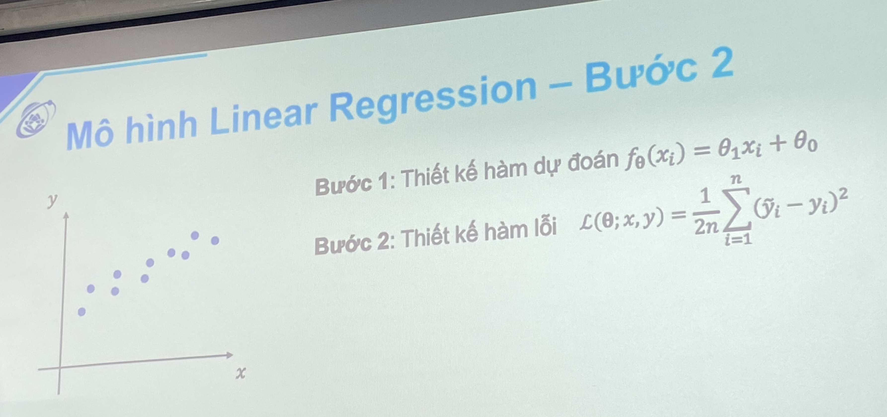

<h2> Mô hình máy học tổng quát</h2>

- Đạo hàm:
    - Đạo hàm dương: Hướng đi lên (bên phải so với cực tiểu)
    - Đạo hàm âm: Hướng đi xuống (bên trái so với cực tiểu)
    - => Dấu đạo hàm ngược hướng điểm cực tiểu.

- Khởi tạo theta random
- Di chuyển về điểm cực tiểu: Theta = theta - f'(theta)

- Problem 1: Giá trị đạo hàm lớn => Khi cập nhật, theta đi "quá đà"
    -  => Solution: nhân với hệ số learning rate alpha: Theta = theta - alpha * f'(theta)
- Problem 2: Cập nhật theta đến khi nào thì dừng.
    - => Solutions 1: Độ dốc không còn hay đạo hàm đủ nhỏ. |dL(theta)|/dtheta < epsilon
    - => Solutions 2: Lặp sau số vòng lặp nhất định (đủ lớn)

- Problem 3: Có nhiều điểm cực tiểu.
    - => Solutions 1: Chạy nhiều lần, lấy giá trị nhỏ nhất => Tốn tài nguyên
    - => Solutions 2: Dùng momentum (quán tính) khi cập nhật
        -  Thuật toán Adam được cài sẵn trong các tensorflow, pytorch.

- **3 công việc cần làm khi thiết kế mô hình:** 
    - Thiết kế mô hình dự đoán f(x)
    - Thiết kế hàm lỗi dự đoán L(theta, x,y)
    - ~~Tìm tham số theta để hàm lộ lỗi L nhỏ nhất~~ => Các mô hình DL.

<h2> Liear Regression</H2>

- Bước 1: Thiết kệ hàm dự đoán: f.theta(xi) = theta1 * x + theta0.
- Bước 2: Thiết kế hàm lỗi:
- Bước 3: Tính đạo hàm. (Cho Tensor, PyTorch tính)

**Nguyên lý Occam**

- Cần học:
    - Đạo hàm của hàm hợp.