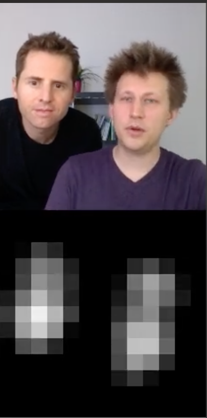

<h2>Neural Network</h2>

- Chứng minh chèn nhiều logictis regression cũng là một Logistic Regression 

- Hồi quy: Dùng MSE, tính khoảng cách để định giá độ sai lệch. (Đúng, gần đúng, dựa trên khoảng cách)
- Phân loại: Cross-Entropy:
    - Đã ddugns là đúng luôn
    - Sai thì bị phạt nặng, hơn => Mô hình học nhanh hơn 
    - => Dùng hàm Log 

- Xác định số layer, số neutron mỗi layer
    - Dùng hyper param tuning.
        - Random search
        - Grid Search.
        - Bayersian Optimization.

- Linear Regression, Logistic regression, Softmax
    Problem:
        - Chỉ giải được bài toán tuyến tính
    Why:
        - Chỉ có 1 layer biến đổi
        - 1 layer  <=> 1 đường thẳng, 1 siêu phẳng

- Neutral Network
    - Ghép nhiều layer trung gian
    - Problem:
        - Overfitting
    - Why:
        - Cơ chế fully connected làm cho số lượng tham số quá nhiều trong khi dữ liệu không nhiều. Dẫn đến overfitting.

<h2>Convolution Neutral network</h2>
    - Solution: Weight sharing localling connected <=> Convolution

<h3>Overfitting</h3>

- Để chống hiện tượng overfitting
    + Tăng số mẫu huấn luyện
    + Giảm độ phức tạp của mô hình (Giảm tham số)

- Question: Tại sao mạng CNN không dùng Sigmoid mà dùng ReLU.

<h2>Start week 5</h2>

- Activation: ReLU => Vanishing gradient
- Pooling: Overfiting
- Flattern: 
- Fully Connected
- Softmax

- Bài tập: cho feature map có vùng highlight màu vùng sáng trên feature map thể hiện vị trí khuôn mặt. Cho biết vị trí gương mặt trên ảnh gốc (dùng pseudocode)

    + B1: Phân ngưỡng ảnh feature để pixel nhận 2 giá trị 0 - 255
    + B2: Tìm các miền liên thông của các điểm màu trắng (255) trong ảnh kết quả Bước 1
        + Output: Danh sách các tọa đọ các cụm màu trắng. Danh sách này có bao nhiêu cụm thì tương ứng có bao nhiêu gương mặt
    + B3: Xác định tọa độ của các bouding box của các cụm sáng từ output bước 2
        + Output: [(left, right, top, bottom), ...]
    + B4: Xác định hệ số thẻ lệ k = kích thước ảnh gốc / kích thước feature
    + B5: Tọa độ bounding box của gương mặt trên gảnh gốc:
        + output:[(k*left, k*right, k*top, k*botoom), ...]

