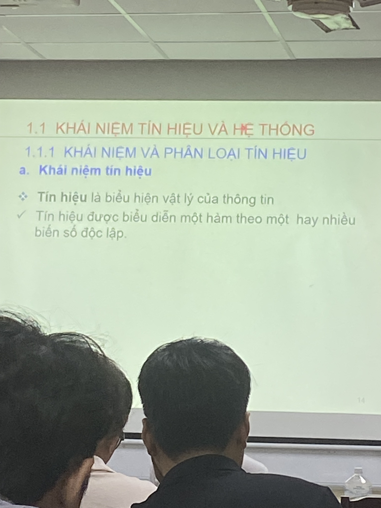

<h1>1. Mục tiêu môn học.</h1>

<h2>a) Kiến thức</h2>

- Học kiến thức về phân tích và thiết kế hệ thống xử lý tín hiệu trong miền thời gian rời rạc, miền Z, miền tần số liên tục và tần số rời rạc
- Học các kiến thức về phân thích, thiết kế và ứng dụng của các bộ lọc số.

<h2>b) Kỹ năng</h2>
- Kỹ năng phân tích và thiết kế hệ thông xử lý tín hiệu số
- Có tư duy hệ thống và nắm được kỹ năng giải quyết bài toán xử lý tín hiệu số.

<h2>c) Thái độ chuyên cần</h2>
- Đến lớp đầy đủ.

<h2>Nội dung chi tiết môn học.</h2>

- CHƯƠNG 1: Tín hiệu và hệ thống rời rạc
- CHƯƠNG 2: Biểu diễn tín hiệu và hệ thống trong miền Z
- CHƯƠNG 3: Biểu diễn tín hiệu và hệ thống trong miền tần số liên tục.
- CHƯƠNG 4: Biểu diễn tín hiệu và hệ thống trong miền tần số rời rạc
- CHƯƠNG 5: Bộ lọc số.
- CHƯƠNG 6: Đồ án môn học.

<h1>Kiến thức toán:</h1>

1. Số Phức.

